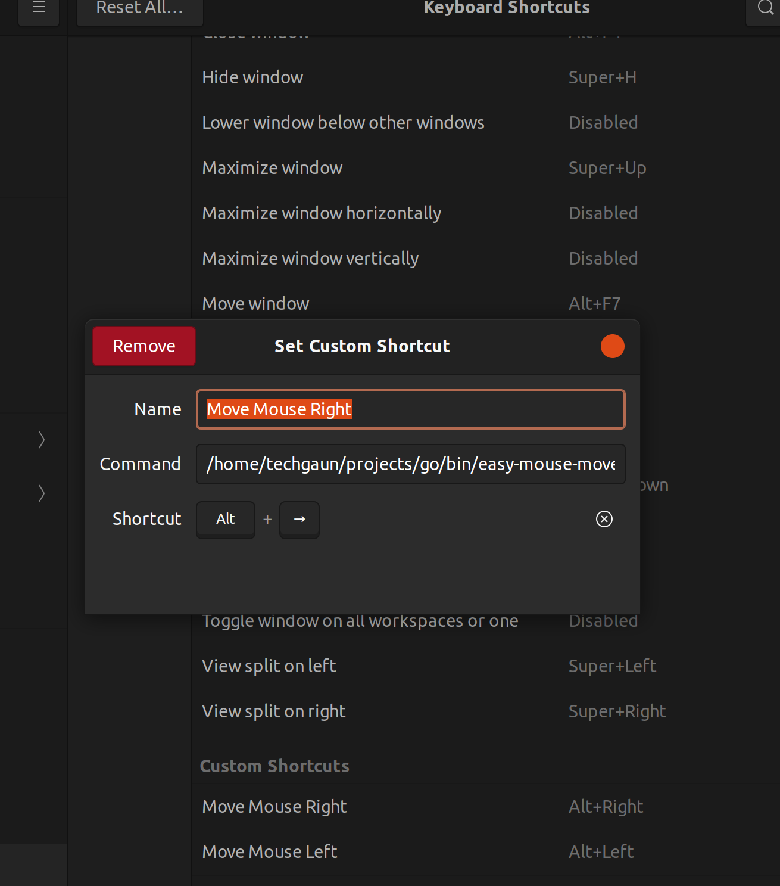

# easy-mouse-mover

> A simple script to move mouse between monitors

This simple script uses xdotool and xrandr
and can be used to move mouse from one monitor
to another with any number of monitors attached.

## Setup

- Install xdotool on your system

```bash
# debian-based eg. ubuntu
sudo apt install -y xdotool
```

- Install with go install

```bash
go install github.com/techgaun/easy-mouse-mover@latest
```

## Usage

- To move to left monitor, type: `easy-mouse-mover left`
- To move to right monitor, type: `easy-mouse-mover right`
- If you are on the left most monitor and try to move to left,
it will move to the right-most monitor (circular by design)

### Keyboard Shortcut

The easiest way to use this tool is by setting up keyboard shortcut on your system.
Refer to your system's documentation to setup the keyboard shortcut.

Here's a sample on Ubuntu 21.04



## LICENSE

Please see [LICENSE](LICENSE)